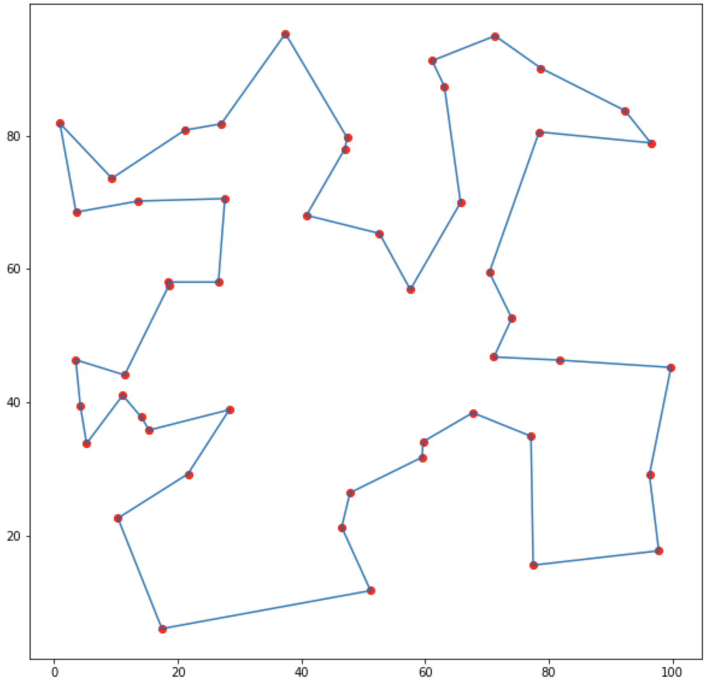

# simulated_annealing_optimal_tour

This method uses simulated annealing to estimate the optimal tour between N points. Each step consists of a random change that is acceped or rejected based on its cost.

Any changes that reduce the cost are automatically accepted, while changes that increase the cost are accepted at random. The acceptance rate decays exponentially with the change in cost $\delta$. 

$$ e^{ - \delta / T} $$

The curve is primarily tuned by the temperature, which is gradually reduced over time. A high initial temperature helps the method explore the solution space without getting trapped in local minima. The temperature is reduced over time to increasingly prioritize directly beneficial changes over exploration.

The temperature is reduced by a scaling factor $\alpha$ at the end of each phase - this parameter, along with the number of phases, determine the curve of the acceptance rate over time. 

Both the transition function and the objective function are user defined. The method is currently designed around coordinate data but it could be adjusted to support more general optimization problems.

The example shows a case with 50 random points and reorders them to obtain the following result. 

